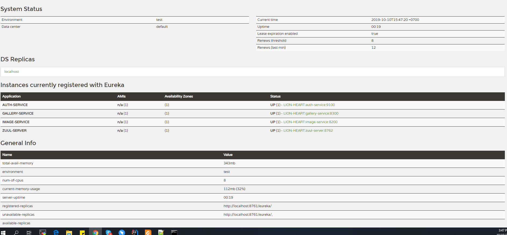
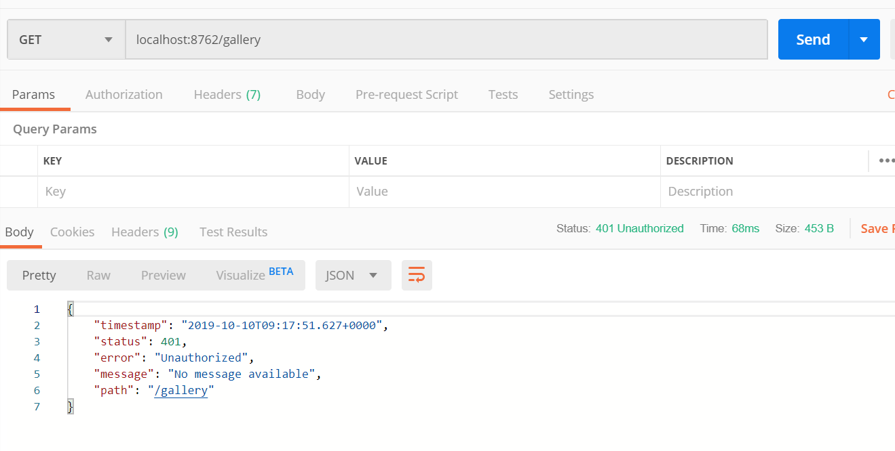
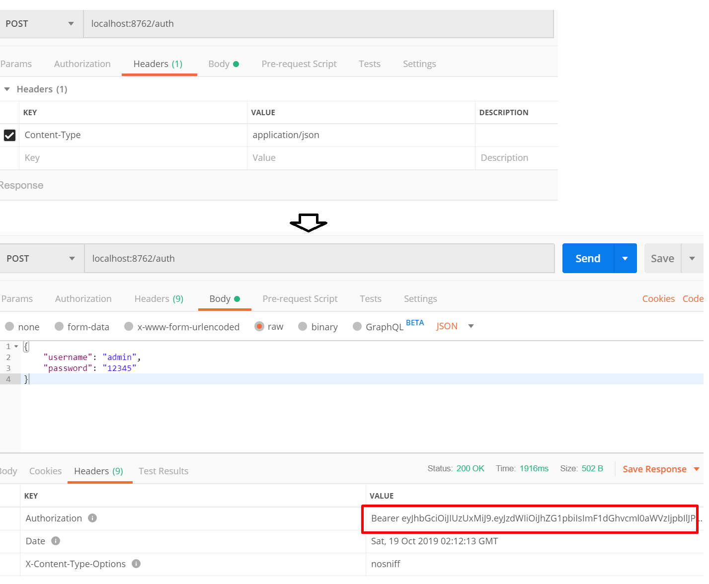
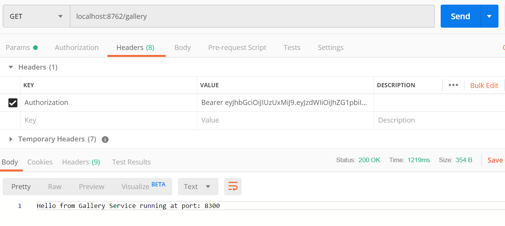

## I. How to demo

1. Cd to root folder of project **demo.microservice.eureka** and start eureka server by commands   
Window version  
`cd ..\demo\microservice\eureka`  
`mvn spring-boot:run`
2. Move to root folder of image service and start image service eureka-client by commands  
`cd ..demo\microservice\image`  
`mvn spring-boot:run`  
3. Move to root folder of gallery service and start gallery service eureka-client by commands  
`cd ..demo\microservice\galery`  
`mvn spring-boot:run` 
4. To check service registry and service discovery, pls access eureka server by go to this on browser  
`http://localhost:8761/`  
5. Start auth service , run below commands  
`cd ..\demo\microservice\auth`  
`mvn spring-boot:run`  

6. Start Zuul like a gateway  
`cd ..\demo\microservice\zuul`  
`mvn spring-boot:run`  

7. The result like this  
  

8. Test microsevices before authentication  . We can use postman to run this GET request  
`localhost:8762/gallery`  
  

9. Get token by call to API (POST)  with header "Content-Type" is application/json   
`localhost:8762/auth`  
  

10. Call gallery service with received token  

---

## II. Technical stack

Main technologies:

1. Spring boot for all services
2. Netflix Eureka server like service registry
3. Netflix Zuul like gateway
4. Netflix Eureka client like service discovery 
5. Spring security + JWT to build authentication service  
6. Spring web for resource services like image , gallery service  
7. Netflix Hystrix like Circuit breaker  
8. ELK (Elasticsearch, logstash, Kibana) for managing, searching, visualizing logs
9. Spring Cloud Config for server config and Vault for encrypt config  
10. Netflix ribbon for load balancer 

## III. Common problems  
1. How to separate and manage module services in Maven and Git  
2. How to manage distributed transaction
3. How to design and separate correct tables for micro-services  
4. Interservice communication   
5. Distributed cache  

---

## References

1. [Microservices with Spring Boot — Intro to Microservices (Part 1)](https://medium.com/omarelgabrys-blog/microservices-with-spring-boot-intro-to-microservices-part-1-c0d24cd422c3)
2. [MicroServices using Spring Boot & Spring Cloud – Part 1 : Overview](https://sivalabs.in/2018/03/microservices-using-springboot-spring-cloud-part-1-overview/)
3. [Martin Flower - Microservices](https://youtu.be/Irlw-LGIJO4)  
4. [Microserives IO](https://microservices.io/)  
5. [Spring Cloud Config](https://sivalabs.in/2018/03/microservices-part-2-configuration-management-spring-cloud-config-vault/)
