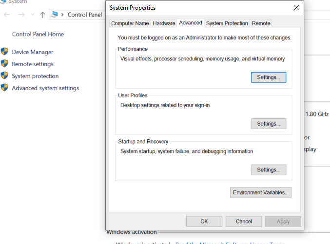
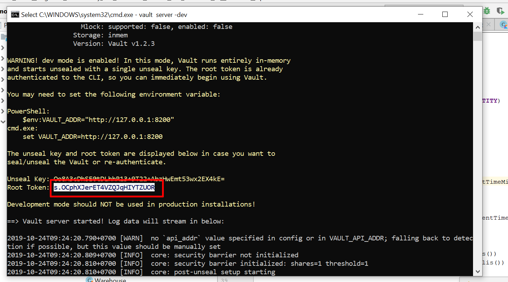

## I. How to demo

1. Cd to root folder of project **demo.microservice.eureka** and start eureka server by commands   
Window version  
`cd ..\demo\microservice\eureka`  
`mvn spring-boot:run`
2. Move to root folder of image service and start image service eureka-client by commands  
`cd ..demo\microservice\image`  
`mvn spring-boot:run`  
3. Set Environment variable for Vault server  
Linux  
`export VAULT_ADDR=’http://127.0.0.1:8200′`  
Window  
  
start Vault server  
`vault server -dev`  
Get root token from console after start Vault  
  
Update this token to bootstrap.properties of galery module  
Write config for gallery service. Move root folder this repo and run below command  
`vault kv put secret/gallery-service @testConfig.json`
4. Start config server  
`cd ..demo\microservice\config`  
`mvn spring-boot:run` 
5. Move to root folder of gallery service and start gallery service eureka-client by commands  
`cd ..demo\microservice\galery`  
`mvn spring-boot:run` 
6. To check service registry and service discovery, pls access eureka server by go to Zuul Dashboard. Access url below on browser  
`http://localhost:8761/`  
7. Start auth service , run below commands  
`cd ..\demo\microservice\auth`  
`mvn spring-boot:run`  

8. Start Zuul like a gateway  
`cd ..\demo\microservice\zuul`  
`mvn spring-boot:run`  

9. The result like this  
  

10. Test microsevices before authentication  . We can use postman to run this GET request  
`localhost:8762/gallery`  
  

11. Get token by call to API (POST)  with header "Content-Type" is application/json   
`localhost:8762/auth`  
  

12. Call gallery service with received token  

---

## II. Technical stack

Main technologies:

1. Spring boot for all services
2. Netflix Eureka server like service registry
3. Netflix Zuul like gateway
4. Netflix Eureka client like service discovery 
5. Spring security + JWT to build authentication service  
6. Spring web for resource services like image , gallery service  
7. Netflix Hystrix like Circuit breaker  
8. ELK (Elasticsearch, logstash, Kibana) for managing, searching, visualizing logs
9. Spring Cloud Config for server config and Vault for encrypt config  
10. Netflix ribbon for load balancer 

## III. Common problems  
1. How to separate and manage module services in Maven and Git  
2. How to manage distributed transaction
3. How to design and separate correct tables for micro-services  
4. Interservice communication   
5. Distributed cache  

## IV. Run project use docker: 
1. Build docker image: 
`docker-compose build`
2. Run compose-file: 
`docker-compose up -d`
3. Put config to vault: 
`docker-compose exec  vaul sh -c "cd /vault/file &&  vault kv put secret/gallery-service @testConfig.json"`
4. Get token from auth: 
`curl -i -X POST -H "Content-Type: application/json" -d '{"username": "admin", "password":"12345"}' localhost:8762/auth`
5. Calling to gallery service use token above: 
`curl -H  "Content-Type: application/json" -H "Authorization: Bearer yourtoken" localhost:8762/gallery`  
  
---

## References

1. [Microservices with Spring Boot — Intro to Microservices (Part 1)](https://medium.com/omarelgabrys-blog/microservices-with-spring-boot-intro-to-microservices-part-1-c0d24cd422c3)
2. [MicroServices using Spring Boot & Spring Cloud – Part 1 : Overview](https://sivalabs.in/2018/03/microservices-using-springboot-spring-cloud-part-1-overview/)
3. [Martin Flower - Microservices](https://youtu.be/Irlw-LGIJO4)  
4. [Microserives IO](https://microservices.io/)  
5. [Spring Cloud Config](https://sivalabs.in/2018/03/microservices-part-2-configuration-management-spring-cloud-config-vault/)  
6. [Vault get started](https://learn.hashicorp.com/vault/getting-started/first-secret)
7. [Spring cloud circuit breaker](https://sivalabs.in/2018/03/spring-cloud-netflix-circuit-breaker/)
8. [Which Strategy You Will Choose to Implement Circuit-Breaker](https://medium.com/@1000lin/which-strategy-you-will-choose-to-implement-circuit-breaker-for-microservices-architecture-dcd690f3c90)
